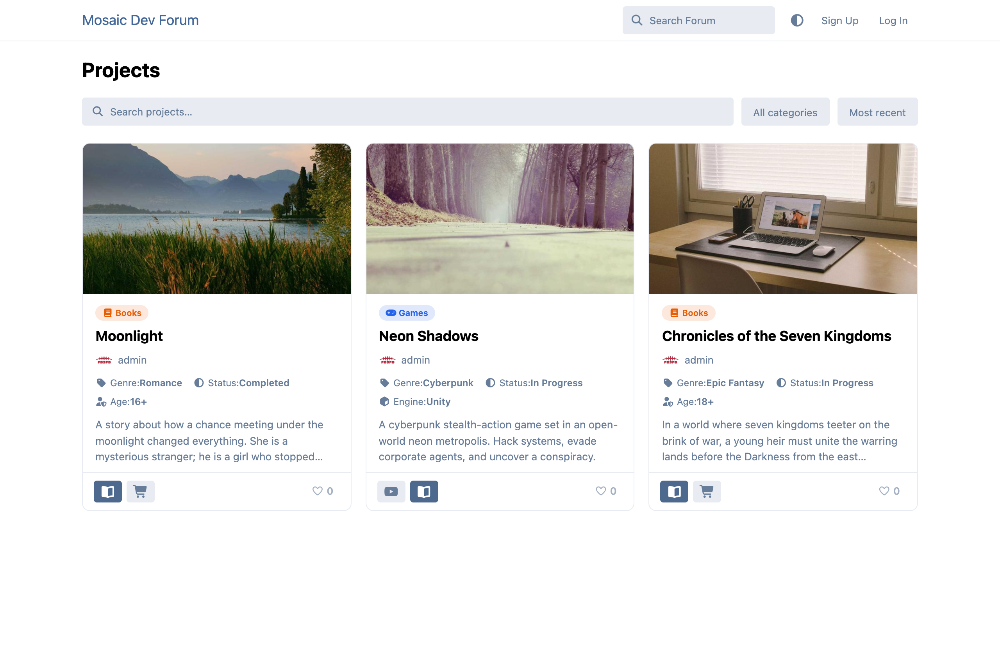
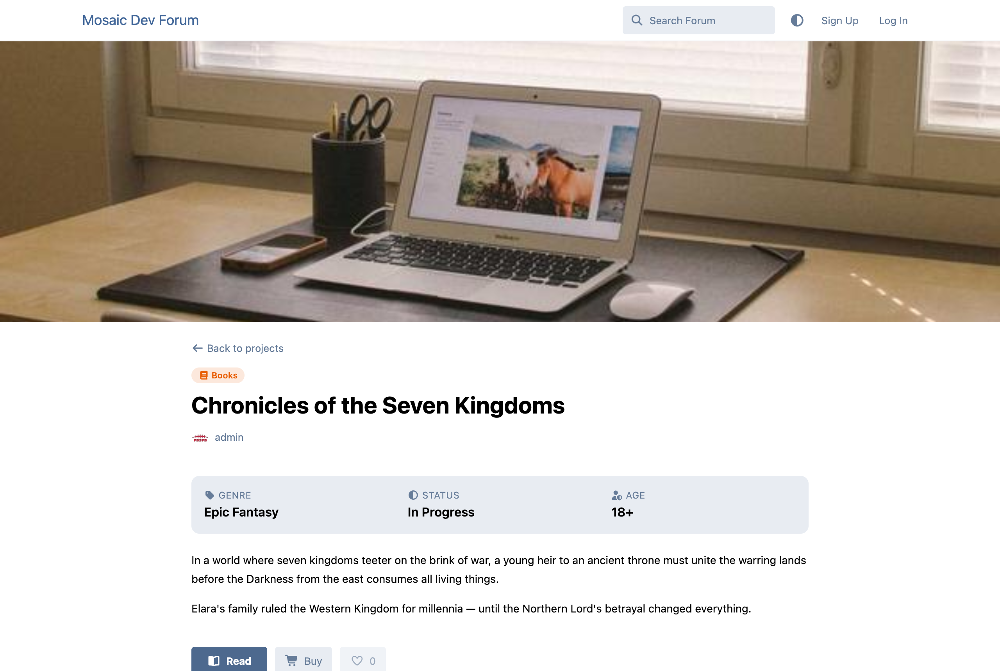
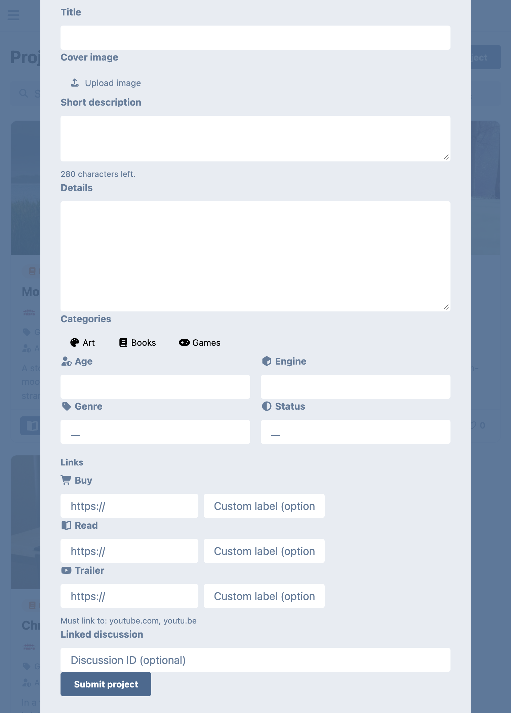
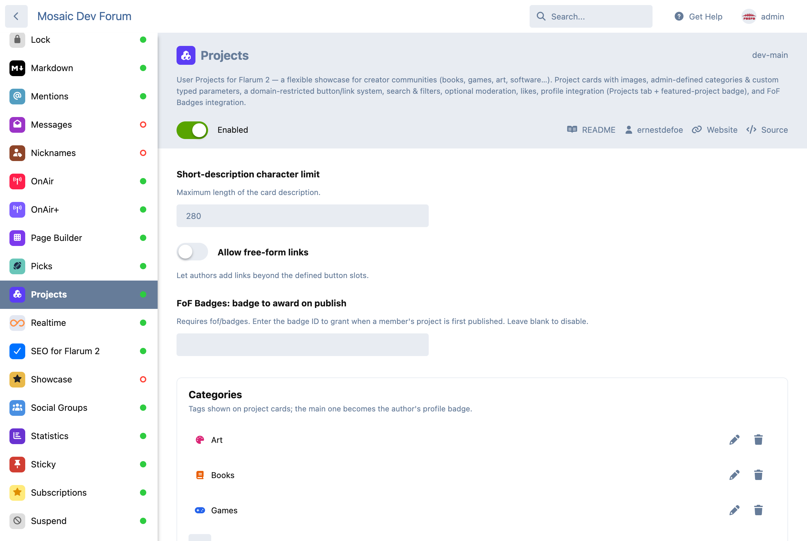

# Projects

A flexible **user projects** extension for **Flarum 2** — a showcase page for creator communities. Members publish "projects" (books, games, apps, art, mods, anything) as cards on a dedicated page, with rich, admin-configurable metadata.

Inspired by [this community request](https://discuss.flarum.org/d/39400-user-projects-extension-for-creator-communities). Free and MIT-licensed.

## Features

- **Project cards** with an optional cover image, author, categories, key parameters, a short description and link buttons — on a dedicated `/projects` page.
- **Search & filters** — full-text search, category filter and sort (recent / most-liked / A–Z), plus an **Add project** button.
- **Admin-defined categories** with an icon and accent colour. A project's *main* category becomes a badge shown next to the author's name across the forum.
- **Custom parameters** — define your own typed fields (text, paragraph, number, date, URL, select, yes/no) such as *Genre*, *Age rating* or *Release date*. Choose which show on the card.
- **Flexible link/button system** — define button slots, optionally **restricted to specific domains** (e.g. only YouTube links), with default or custom labels. Example for a book: *Read Excerpt*, *Buy*, *Discuss on Forum*.
- **Optional moderation** — projects can publish instantly or wait for approval, controlled per-group by the `Publish without moderation` permission.
- **Detail page** with forum-formatted content, all parameters and link buttons; link a forum discussion for comments.
- **Built-in likes** on every project.
- **Profile integration** — a **Projects** tab on each member's profile, plus a featured-project badge (their main category's icon, with the project name on hover) next to their username everywhere.
- **FoF Badges integration** *(optional)* — award a badge when a member's project is first published.

## Screenshots

| Browse page | Project detail |
| --- | --- |
|  |  |

| Submission form | Admin configuration |
| --- | --- |
|  |  |

## Permissions

| Permission | Default |
| --- | --- |
| Create projects | Members |
| Publish without moderation | — (admins/mods always can) |
| Moderate projects | Moderators |

## Installation

```sh
composer require ernestdefoe/projects
php flarum migrate
php flarum cache:clear
```

Then open **Admin → Projects** to add categories, custom parameters and button slots.

## License

[MIT](LICENSE)
